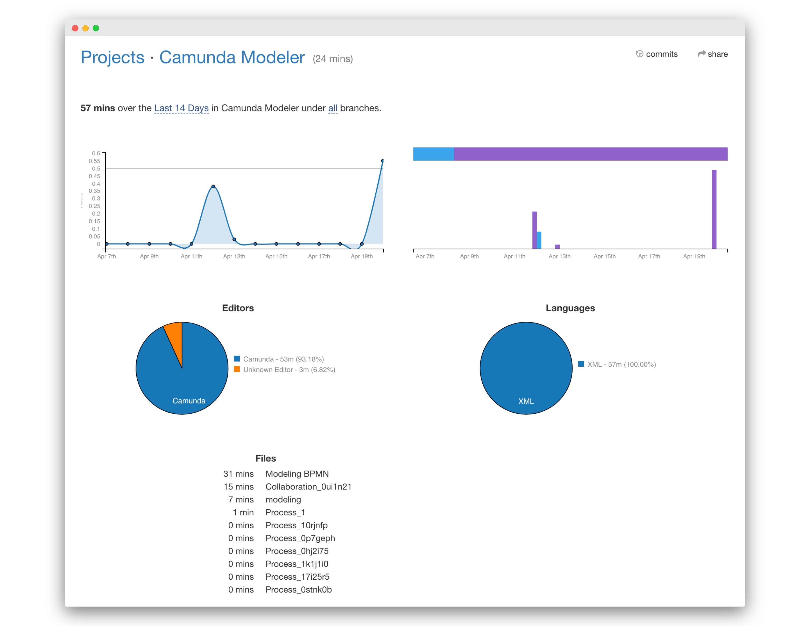

# camunda-modeler-wakatime-plugin
[Wakatime](https://wakatime.com) Plugin for the [Camunda Modeler](https://github.com/camunda/camunda-modeler)

[](https://travis-ci.org/pinussilvestrus/camunda-modeler-wakatime-plugin) [](https://github.com/camunda/camunda-modeler)

## How to use

1. Download and copy this repository into the `plugins` directory of the Camunda Modeler
2. Start the Camunda Modeler
3. When an API-Key is added, the application will start sending activity heartbeats to Wakatime


## Compatibility Notice

Due to the flag loading, this plug-in is compatible with Camunda Modeler `v3.0+`.

## Building

Install dependencies:

```sh
npm install
```

Package plugin to `client/client-bundle.js` + `menu/menu-bundle.js`:

```sh
npm run bundle
```


## Adding Wakatime API-Key

Before the application will send heartbeats to Wakatime, you will have to add an [API-Key](https://wakatime.com/faq#api-key) inside your local `flags.json`

```json
{
    "wakatime-api-key": "YOUR_API_KEY"
}
```

or to `$WAKATIME_HOME/.wakatime.cfg` (likely inside your `$HOME` directory)

```ini

[settings]
api_key = YOUR_API_KEY

```

## Screenshots



## Logging

To enable logging different actions + errors to the Camunda  Modeler application log, simply add the `debug` option to your `$WAKATIME_HOME/.wakatime.cfg` configuration

```ini

[settings]
debug = true

```


## Additional Resources

* [Camunda Modeler: Flags documentation](https://github.com/camunda/camunda-modeler/tree/master/docs/flags)
* [Camunda Modeler: Plugins documentation](https://github.com/camunda/camunda-modeler/tree/master/docs/plugins)
* [Wakatime: Configuration documentation](https://github.com/wakatime/wakatime#configuring)


## Licence

MIT

